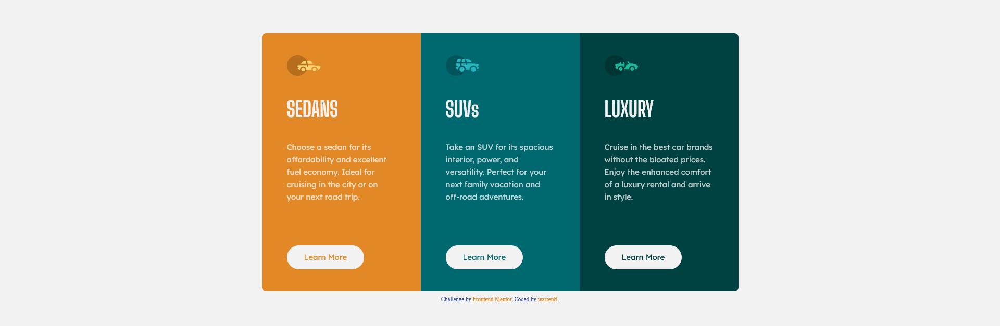

# Frontend Mentor - 3-column preview card component solution

This is a solution to the [3-column preview card component challenge on Frontend Mentor](https://www.frontendmentor.io/challenges/3column-preview-card-component-pH92eAR2-). Frontend Mentor challenges help you improve your coding skills by building realistic projects.

## Table of contents

- [Overview](#overview)
  - [The challenge](#the-challenge)
  - [Screenshot](#screenshot)
  - [Links](#links)
- [My process](#my-process)
  - [Built with](#built-with)
  - [What I learned](#what-i-learned)
  - [Continued development](#continued-development)
  - [Useful resources](#useful-resources)
- [Author](#author)
- [Acknowledgments](#acknowledgments)

## Overview

### The challenge

Users should be able to:

- View the optimal layout depending on their device's screen size
- See hover states for interactive elements

### Screenshot



### Links

- Solution URL: [Git Hub](https://github.com/warrenbarney/3-column)
- Live Site URL: [netlify](https://main--delicate-entremet-1b51a9.netlify.app/#0)

## My process

### Built with

- Semantic HTML5 markup
- CSS custom properties
- Flexbox
- Mobile-first workflow
- SCSS

### What I learned

I tried to improve assesibility by using more landmark tags.  
I have more understanding of Sass varibles and CSS selectors.
I tried to use more descriptive classes.

```css
[class^="card_"] {
    display: flex;
    flex-direction: column;
    justify-content: space-around;
    align-items: start;
    height: 28em;
    width: 320px;
    padding: 1.5em 3em;
    // border: 1px dotted blue;
}
```

```scss
$font-family1: 'Big Shoulders Display', cursive;
$font-family2: 'Lexend Deca', sans-serif;
$bright_orange: hsl(31, 77%, 52%);
$dark_cyan: hsl(184, 100%, 22%);
$very_dark_cyan: hsl(179, 100%, 13%);
$transparent_white: hsla(0, 0%, 100%, 0.75);
$very_light_gray: hsl(0, 0%, 95%);
```

### Continued development

I hope to have a clearer understanding of best practices and gain as much knowledge as possible.

### Useful resources

- [CSS attrribute selectors](https://www.w3schools.com/css/css_attribute_selectors.asp) - This helped me see the logic behind selectors.
- [Sass variables](https://sass-lang.com/guide/#variables) - I am really enjoying Sass it makes everything so much cleaner.

## Author

- Git Hub - [warrenbarney](https://github.com/warrenbarney)
- Frontend Mentor - [@warrenbarney](https://www.frontendmentor.io/profile/warrenbarney)
- Twitter - [@WarrenBarney73](https://twitter.com/WarrenBarney73)

## Acknowledgments

I am very excited to be a part of frontend mentor community.  
Thank you all for suggestions. I hope that I can be helpful to someone on the way😃.
